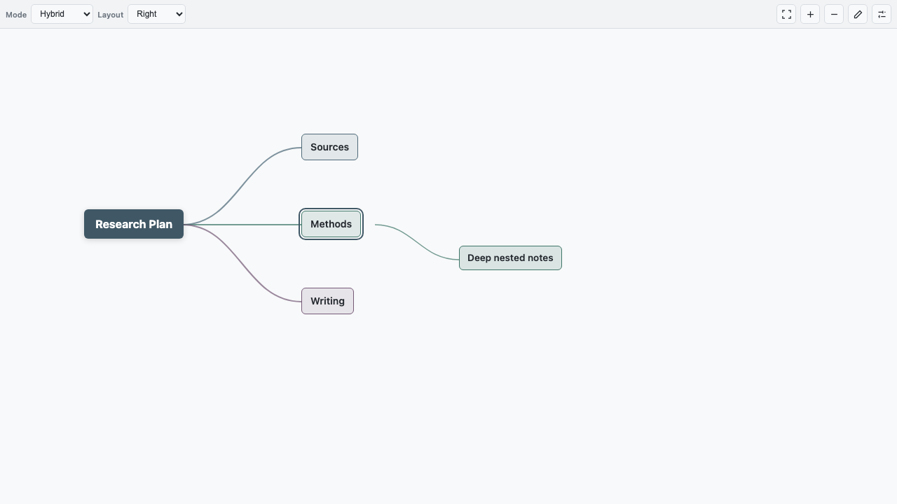
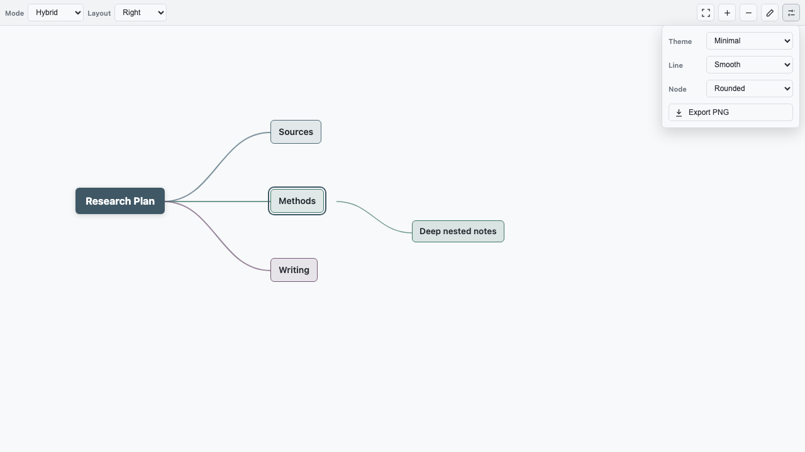
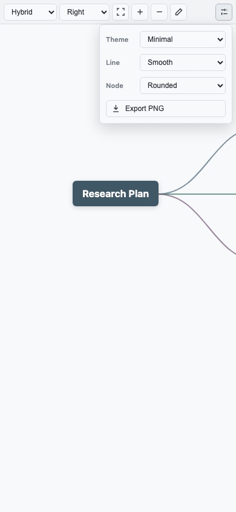

# Stratify Mindmap

[English](README.md) | **简体中文**

Stratify Mindmap 是一个以 Markdown 为数据源的 Obsidian 思维导图插件。它让导图在电脑和手机上仍然保持为可阅读、可编辑的 Markdown，同时支持超过六层的节点结构。

界面采用紧凑设计：结构模式和布局保留在主工具栏，常用视图操作使用图标，主题、连线、节点样式和导出收进同一个菜单。

## 主要特点

- 支持超过六层的思维导图
- 支持 Heading、Hybrid、List 三种 Markdown 结构
- 转换现有 Markdown 时自动识别结构
- 直接编辑节点并写回 Markdown
- 支持跨父级、同级前后位置的拖拽
- 支持方向键选择节点和键盘调整层级
- 支持导图操作的撤销与重做
- 支持 Obsidian 双向链接、节点折叠、多种布局和 PNG 导出
- 默认使用跟随 Obsidian 明暗模式的扁平 Minimal 主题
- 支持桌面端和移动端

## 界面示意

以下图片展示当前版本的 Stratify 界面布局。

### 导图总览



### 外观与导出菜单



### 手机端工具栏



## Markdown 结构模式

| 模式 | 源文档格式 | 推荐用途 |
| --- | --- | --- |
| Heading | `#` 到 `######` | 六层以内、偏文档大纲的导图 |
| Hybrid | 标题后接嵌套列表 | 超过六层且仍需保持文档可读性 |
| List | 纯嵌套 Markdown 列表 | 手机端快速缩进编辑和深层结构 |

当前模式保存在 `mindmap-structure`。缺少该字段时，Stratify 会自动判断笔记是纯标题、标题加列表还是纯列表。

```yaml
---
type: mindmap
mindmap-structure: hybrid
mindmap-layout: right
mindmap-theme: minimal
mindmap-line: curve
mindmap-node: rounded
---

# 项目
## 调研
### 资料来源
#### 文献筛选
##### 研究方法
###### 证据
- 原始研究
  - 纳入文献
    - 详细笔记
```

## 编辑操作

| 操作 | 手势或快捷键 |
| --- | --- |
| 选择节点 | 点击或使用普通方向键 |
| 编辑文字 | 双击或 `F2` |
| 新增同级节点 | `Enter` |
| 新增子节点 | `Tab` |
| 删除节点 | `Delete` 或 `Backspace` |
| 折叠或展开 | `Space` |
| 同级上下移动 | `Shift + ArrowUp/ArrowDown` |
| 提升一级 | `Shift + Tab` 或 `Mod + ArrowLeft` |
| 降为上一个同级节点的子节点 | `Mod + ArrowRight` |
| 撤销 | `Mod + Z` |
| 重做 | `Mod + Shift + Z` 或 `Mod + Y` |

拖到目标节点上半区或下半区，会插入到目标前面或后面。拖到没有子节点的节点外侧，可以将其变成该节点的子节点；这一行为可在设置中关闭。

## 工具栏与设置

主工具栏保留 Mode、Layout、适应画布、缩放和编辑 Markdown。主题、连线、节点形状和 PNG 导出位于右侧外观菜单。

Obsidian 设置页面可指定新导图的默认结构、布局、主题、连线和节点样式，也可以控制方向键导航与叶节点拖拽行为。修改默认值不会覆盖已有笔记的 frontmatter。

## 新建与转换

- 使用左侧 ribbon 或命令面板中的 **Convert current note to Stratify mindmap**。
- 右键 Markdown 文件并选择 **Convert to Stratify mindmap**。
- 右键文件夹并选择 **Create Stratify mindmap**。

转换只添加所需 frontmatter 并识别正文结构，不会重写原正文。

## 安装

Stratify Mindmap 目前采用手动安装，尚未进入 Obsidian 社区插件市场。

1. 新建 `<vault>/.obsidian/plugins/stratify-mindmap/`。
2. 将 `main.js`、`manifest.json`、`styles.css` 放入该目录。
3. 重新加载 Obsidian。
4. 在 **设置 -> 社区插件** 中启用 **Stratify Mindmap**。

不要同时启用 Stratify Mindmap 与 Light Mindmap/Light Mindmap Plus，因为它们都会渲染 `type: mindmap` 笔记。

## 从 Light Mindmap 迁移

Stratify 保留了 `type: mindmap` 和现有 `mindmap-*` frontmatter，因此旧导图无需转换。由于插件 ID 已改变，插件级设置会单独保存；迁移一次默认设置后即可停用旧插件。

## 兼容性

- Obsidian 1.4.0 或更高版本
- 支持 macOS、Windows、Linux、iOS 和 Android
- 导图内容仍是 Markdown，因此兼容 Obsidian Sync

## 致谢与许可证

Stratify Mindmap 是 [Light Mindmap](https://github.com/ninglg/light-mindmap) 的独立衍生版本。原项目作者为 Light Ning；本项目保留原版权声明，并继续使用 MIT License。
